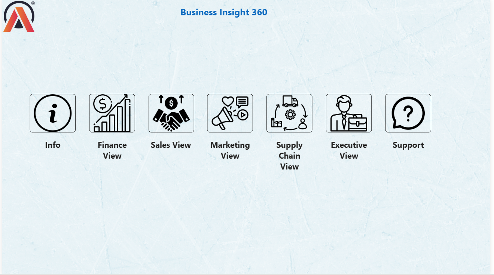

# 🧭 Business Insight 360 — AtliQ Hardware

> A multi-functional Power BI dashboard giving AtliQ Hardware a 360° view of its global business performance — spanning Finance, Sales, Marketing, Supply Chain, and Executive reporting.

---

## 📑 Table of Contents

- [Overview](#-overview)
- [Tech Stack](#-tech-stack)
- [Data Model](#-data-model)
- [Dashboard Views](#-dashboard-views)
- [Key Highlights](#-key-highlights)
- [Business Impact](#-business-impact)
- [Power BI Techniques Used](#-power-bi-techniques-used)
- [Dashboard Preview](#-dashboard-preview)
- [Getting Started](#-getting-started)

---

## 📌 Overview

A multi-functional Power BI dashboard that gives AtliQ Hardware a 360° view of its global business performance — spanning Finance, Sales, Marketing, Supply Chain, and Executive reporting. This was AtliQ's first foray into data-driven decision-making using Power BI, replacing ad-hoc Excel analyses that previously led to costly misjudgments (e.g., a failed store launch in the US).

---

## 🛠️ Tech Stack

| Technology | Purpose |
|-----------|---------|
|  | Dashboard design and visualization |
|  | Source database for transactional data |
|  | Secondary data source (CSV files) |
| `DAX` | Calculated columns, measures, KPIs |
| `DAX Studio` | Report performance optimization |
| `Power Query (M)` | Data transformation and date table creation |
| `GitHub LFS` | Large file version control |

---

## 🗂️ Data Model

Built using the **Snowflake Schema** methodology.

**Dimension Tables**

| Table | Description |
|-------|-------------|
| `dim_customer` | 75 customers across 27 markets, 2 platforms (Brick & Mortar, E-Commerce), 3 channels |
| `dim_market` | 27 markets, 7 sub-zones, 4 regions (APAC, EU, LATAM, NA) |
| `dim_product` | 3 divisions (P&A, PC, N&S), 14 categories, multiple variants |

**Fact Tables**

| Table | Description |
|-------|-------------|
| `fact_sales_monthly` | Monthly actual sales quantities |
| `fact_forecast_monthly` | Monthly demand forecasts for inventory optimization |
| `freight_cost` | Shipping cost per market per year |
| `gross_price` | Product gross pricing reference |
| `manufacturing_cost` | Production cost per product per year |
| `pre_invoice_deductions` | Deductions applied before invoicing |
| `post_invoice_deductions` | Deductions applied after invoicing |

---

## 📊 Dashboard Views

| View | Purpose |
|------|---------|
| 🏠 **Home** | Navigation hub to all views |
| 💰 **Finance View** | P&L analysis, gross margin, net sales trends |
| 🛒 **Sales View** | Customer and product-level sales performance |
| 📣 **Marketing View** | Campaign ROI and segment performance |
| 🔗 **Supply Chain View** | Forecast accuracy, inventory risk |
| 🧭 **Executive View** | Top-level KPIs for leadership |
| 🛍️ **Products** | Product performance deep-dive |

---

## ✨ Key Highlights

- Pulled data from **2 heterogeneous sources** (MySQL database + Excel/CSV files) into a unified model.
- Optimized report performance using **DAX Studio**, achieving a **5% improvement** in load and query time.
- Used bookmarks, page navigation buttons, dynamic titles, KPI indicators, and conditional formatting for a polished UX.
- Implemented a custom date table using **M Language** and divide-safe DAX measures to prevent zero-division errors.

---

## 📈 Business Impact

| Impact | Detail |
|--------|--------|
| 🌍 **Global visibility** | Analyze sales trends across all markets and departments in one platform |
| 📈 **Revenue acceleration** | Projected **10% faster revenue growth** through data-backed decisions |
| 💸 **Cost reduction** | Estimated **20% reduction** in data-related expenses by replacing fragmented Excel reports |
| 🎯 **Single source of truth** | Eliminated siloed, inconsistent reporting across departments |

---

## 💡 Power BI Techniques Used

- Calculated columns and measures with **DAX**
- **Bookmarks** for toggling between visuals
- **Dynamic titles** based on applied filters
- **KPI indicators** and conditional formatting (icons + background color)
- Published to **Power BI Service** with personal gateway for auto-refresh
- Power BI **App creation** with workspace collaboration and access permissions
- Large file version control via **GitHub LFS**

---

## 📊 Dashboard Preview



🔗 **[View Live Dashboard](https://app.powerbi.com/view?r=eyJrIjoiNGIzMDYzNmUtZDgyNi00YjJlLWE1ZDEtZjNmYjEyYmY5MDMwIiwidCI6IjJmM2ViMmYzLTIwNjItNGRlOS04MmM5LTA3ZGIzZmFkMGJhNCJ9)**

---

## 🚀 Getting Started

### 1. Clone the Repository

```bash
git clone https://github.com/your-username/business-insight-360.git
cd business-insight-360
```

### 2. Open in Power BI Desktop

- Open the `.pbix` file in **Power BI Desktop**
- Update the **MySQL connection** credentials to point to your local database
- Update the **Excel/CSV file paths** if required
- Click **Refresh** to load the latest data

### 3. Publish to Power BI Service *(optional)*

- Sign in to Power BI Service
- Publish the report from Power BI Desktop
- Set up a **personal gateway** for scheduled auto-refresh

---

## 👤 Author

Built as part of a hands-on data analytics learning journey, applying real-world business scenarios to develop skills in data modeling, visualization, storytelling with data, and BI tool optimization.

**Tools & Technologies across portfolio:** Excel · Power Query · DAX · Power BI · SQL (MySQL) · DAX Studio · Python · Pandas · NumPy · Matplotlib · Seaborn · GitHub LFS

---

## 📄 License

This project is open-source for educational and portfolio purposes.

---

<p align="center">
  <b>Power BI &nbsp;•&nbsp; SQL (MySQL) &nbsp;•&nbsp; DAX &nbsp;•&nbsp; Power Query</b><br>
  <i>From fragmented Excel reports to a 360° business intelligence platform</i>
</p>
